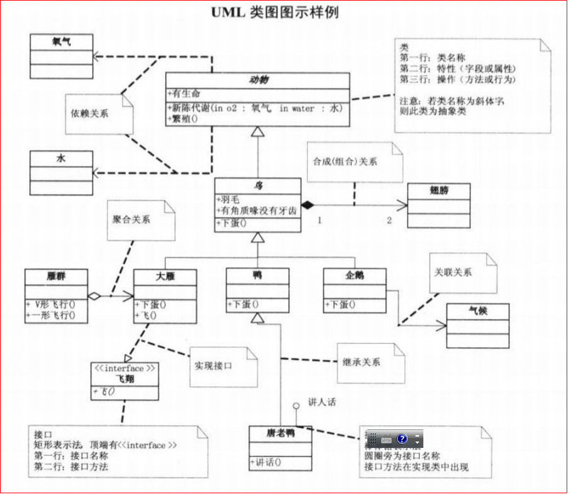

设计模式，公认的有23种设计模式，分别对应23种设计场景。

千万不要以为有任何一种设计模式，能解诀任何问题，每- -种设计模式只能用于适用的场景，而不是万能的。

设计模式有优点，也有缺点。我们不要为了适用设计模式而使用设计模式。切记防止“模式的滥用”!

23种设计模式，背后其实是7大设计原则。也就是说，每个设计模式都归属于-一个或多个设计原则。
7大设计原则的背后又是，一个字，分

7大设计原则，分别有，
1. 单一职责原则
2. 里氏替换原则
3. 依赖倒置原则
4. 开闭原则
5. 迪米特法则（最少知道原则）
6. 接口隔离原则
7. 组合优于继承原则

学习设计模式，2根线
1. 开发代码的程序员，被划分为两种角色
   作者（服务器端程序员）
   用户（客户端程序员）
2. 不能随意修改源码

类与类 之间的关系

组合  之间联系比较紧密   表示 实 心 合成(组合)
聚合  聚合是聚在一起     表示 空 心 聚合

总结

a) 继承和实现一般没有争议

b) 后四种关系的强弱：组合>聚合>关联>依赖。

c) 关联和依赖的区别：

i. 关联关系强、长期

ii. 关联关系是通过属性来实现；依赖关联是通过方法形参或者局部变量实现

d) 关联、组合/聚合的异同

i. 相同：都是关联，都是做类的属性

ii. 不同点：组合 /聚合表示的是整体和部分的关系，关联可以表示所有关系

e) 组合和聚合的异同

i. 相同：都是关联的特例，都是表示的整体和部分的关系

ii. 不同点：整体部分的生命周期是否相同?组合更强

p1  单一职责  和 p6  没有写入
https://www.bilibili.com/video/BV1Qx411o7tN?p=6
